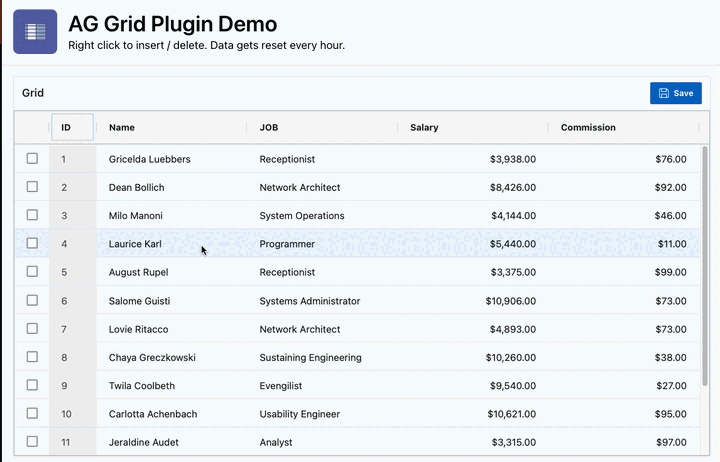

# APEX AG Grid Plugin

Implementation of the Community Edition [AG Grid](https://www.ag-grid.com/) component wich enables a more spreadsheet like data editing experience. Internally it uses the [Infinite Row Model](https://www.ag-grid.com/javascript-data-grid/infinite-scrolling/) and can be used as an alternative to the Interactive Grid.

[Interactive Demo](https://apex.oracle.com/pls/apex/r/hartenfeller_dev/ag-grid-plugin-demo)

## Beta Status

This Plug-In is currently in a beta status. Expect bugs and changes. Please submit feedback, bugs, request etc. as GitHub issues or discussions.

## Installation

1. Go to latest GitHub release and download the zip
2. Install DB Package
3. Install both region and dynamic action Plug-Ins

## Usage

1. Create a region and select a data source
2. Create your own Save Button and add the dynamic action as on click action
3. Set affected region to the Region Plug-In and put your DML-Code
